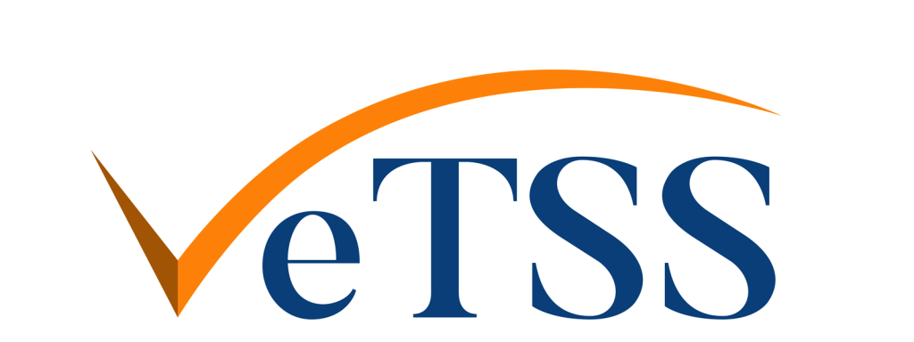

<i>Fun in the Afternoon / S-REPLS 13</i> 
<i>Wednesday 1st November, 10am - 7pm, <a href="https://engine-shed.co.uk" target="_blank">Engine Shed</a>, <a href="https://goo.gl/maps/4UMxDXYtNHgmGscm9" target="_blank">Bristol BS1 6QH</a></i>

*<a href="https://srepls.github.io" target="_blank">S-REPLS</a>* is a regular meeting, based in the south of England, for anyone with an interest in the semantics and implementation of programming languages.  *Fun in the Afternoon* is a seminar on functional programming and related topics.  This site describes the arrangements for a joint meeting of these two communities at Bristol Engine Shed in November 2023.

### Keynotes

* Bob Atkey, University of Strathclyde
    - *Data Types with Negation*
    - Inductive data types are a foundational tool for representing data and knowledge in dependently typed programming languages. The user defines an inductive data type by declaring constructors for constructing positive evidence. For example, evidence of a path through some graph, or the parse tree as evidence that a context-free grammar accepts some input. But in some cases, positive evidence is not enough. What if we want evidence that no path exists? or we want to represent parse trees of backtracking parsers, where alternatives are only tried in the case when another parse didn't work? In this talk, I will explain how the use of negative evidence arises in many places in programming languages, describe a way of extending inductive data types with negation, and how we can understand them as a complex interaction of inductive and coinductive types.
* Ákos Hajdu, Meta/WhatsApp
    - *Static and dynamic code analyses for WhatsApp server*
    - This talk gives an overview of the code analysis techniques that regularly scan WhatsApp server's Erlang codebase. We focus on a dynamic analysis based on traffic generation and static analyses based on symbolic execution and abstract interpretation. The analyses are capable of detecting pre-defined issues (such as crashes), as well as user-defined properties (such as taint analysis). We report on our experience and the challenges of deploying these analyzers on Erlang code at an industrial scale, supporting the messaging app used everyday by over 2 billion people.

### Programme

<table>
<tr><td style="min-width:15ex">09:00 - 09:50</td><td>Arrival</td></tr>

<tr><td>09:50 - 10:00</td><td>Welcome from the organisers</td></tr>

<tr><td style="vertical-align:top">10:00 - 11:15</td><td>Contributed Talks 1   
    <ul>
      <li>10:00 : <a target="_blank" href="assets/abstracts/frohlich.txt">Embedding by Unembedding</a> &emsp;&emsp;&emsp; Sam Frohlich, University of Bristol</li>
      <li>10:25 : <a target="_blank" href="">Brief Introduction to Isabelle's Code Generator</a> &emsp;&emsp;&emsp; Achim Brucker, University of Exeter</li>
      <li>10:50 : <a target="_blank" href="assets/abstracts/schaefer.txt">Algebraic Data Types for Datalog</a> &emsp;&emsp;&emsp; Max Schaefer, GitHub</li>
    </ul>
  </td>
</tr>

<tr><td>11:15 - 11:30</td><td>Break (15 mins)</td></tr>

<tr><td>11:30 - 12:30</td><td>Keynote 1: Bob Atkey, University of Strathclyde</td></tr>

<tr><td>12:30 - 13:30</td><td>Lunch (60 mins)</td></tr>

<tr><td>13:30 - 14:30</td><td>Keynote 2: Akos Hajdu, Meta/WhatsApp</td></tr>

<tr><td>14:30 - 14:45</td><td>Break (15 mins)</td></tr>

<tr>
  <td style="vertical-align:top">14:45 - 16:00</td>
  <td>Contributed Talks 2 
    <ul>
      <li>14:45 : <a target="_blank" href="https://www.microsoft.com/en-us/research/publication/co-audit-tools-to-help-humans-double-check-ai-generated-content/">Co-audit: tools to help humans double check AI-generated content</a> &emsp;&emsp;&emsp; Andy Gordon, Microsoft Research</li>
      <li>15:10 : <a target="_blank" href="assets/abstracts/altenkirch.txt">Coinduction in Cubical Agda</a> &emsp;&emsp;&emsp; Thorsten Altenkirch, University of Nottingham</li>
      <li>15:35 : <a target="_blank" href="assets/abstracts/marshall.txt">Linearity, Uniqueness, Ownership: An Entente Cordiale</a> &emsp;&emsp;&emsp; Daniel Marshall, University of Kent</li>
    </ul>
  </td>
</tr>

<tr><td>16:00 - 16:30</td><td>Break (30 mins)</td></tr>

<tr>
  <td style="vertical-align:top">16:30 - 17:20</td>
  <td>Contributed Talks 3 
    <ul>
      <li>16:30 : <a target="_blank" href="assets/abstracts/thatcher.pdf">Parallel Functional Programming with Interaction Nets</a> &emsp;&emsp;&emsp; Marc Thatcher, University of Sussex</li>
      <li>16:55 : <a target="_blank" href="assets/abstracts/milovancevic.txt">Proving and Disproving Equivalence of Fun. Prog. Assignments</a> &emsp;&emsp;&emsp; Dragana Milovancevic, EPFL</li>
    </ul>
  </td>
</tr>

<tr><td>17:20 - 17:50</td><td>Break (30 mins)</td></tr> 

<tr>
  <td style="vertical-align:top">17:50 - 18:40</td>
  <td>Contributed Talks 4
    <ul>
      <li>17:50 : <a target="_blank" href="assets/abstracts/yu.txt">Reasoning About MLIR Semantics Through Effects and Handlers</a> &emsp;&emsp;&emsp; Jacob Yu, Imperial College London</li>
      <li>18:15 : <a target="_blank" href="assets/abstracts/hu.txt">Visualising program dataflow with string diagrams</a> &emsp;&emsp;&emsp; Nick Hu, University of Oxford</li>
    </ul>
  </td>
</tr>

<tr><td>18:40 - 19:00</td><td>Closing</td></tr>
</table>

### Attendance

The meeting will take place from 10am to 7pm on Wednesday 1st of November in <a href="https://engine-shed.co.uk/" target="_blank">Engine Shed</a>, <a href="https://goo.gl/maps/4UMxDXYtNHgmGscm9" target="_blank">Bristol BS1 6QH</a>.  

Please sign up at <a href="https://www.eventbrite.com/e/717109883967/" target="_blank">EventBrite</a> if you wish to attend.

Attendance is free of charge, and both refreshments and lunch will be provided, but we need you to sign up because places are limited and catering requirements must be estimated.

<!-- ### Proposing a Talk

Talks are typically 20-30 minutes long and should be given in person.  We invite proposals for talks on any topic related to programming languages.  Subjects related to functional programming, and submissions from industrial professionals and junior researchers (postdocs and students) are especially welcome.

Please e-mail Alex Kavvos and Steven Ramsay on <pl-rg@bristol.ac.uk> with the subject "FITR talk proposal", giving a draft title and an abstract by the end of:
 
  * Mon, 2 October 2023 -->

### Travel

Engine shed is adjacent to Bristol Temple Meads railway station.  Great Western Railway (GWR) offer some <a href="https://www.visitwest.co.uk/meet/how-we-can-help/discounted-train-travel">reduced rail fares</a> for event delegates if you are travelling from a station operated by GWR.

There is parking in Bristol Temple Meads station car park, though it is <a href="https://www.apcoa.co.uk/parking-in/bristol/bristol-temple-meads/">expensive</a> and fills up quickly.  Alternative parking can be found on <a target="_blank" href="https://en.parkopedia.co.uk/parking/locations/temple_meads_station_i8iagcnhtjyxwfj413/?country=uk&arriving=202311010930&leaving=202311011900">Parkopedia</a>.

### Organisers & Sponsors

{:style="width:200px; float:left;margin:0 20px 0 20px;"}
This event is made possible by the generous sponsorship of the [UK Research Institute on Verified Trustworthy Software Systems](https://vetss.org.uk/).

{:style="width:200px; float:left; margin:0 20px 0 20px;"}
The event is organised and part funded by the <a href="https://plrg-bristol.github.io/" target="_blank">Programming Languages Research Group</a> (PLRG) at the University of Bristol.  For any queries, please contact: Alex Kavvos and Steven Ramsay on pl-rg@bristol.ac.uk.
